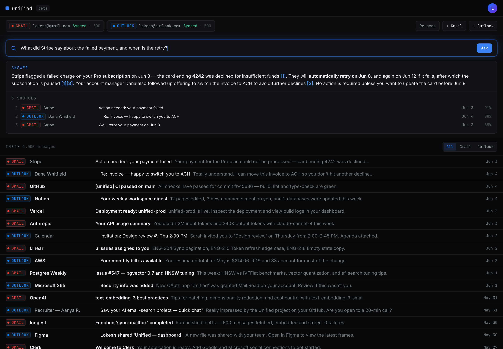

# Data Unification

[](https://github.com/LokeshProductBuilder/AI-Data-Unification-and-Search-Platform/actions/workflows/ci.yml)
[](LICENSE)

A personal data platform. Connect Gmail and Outlook, pull your email, and search it with natural language powered by Claude.

## Product docs

- [**Product Requirements Document (PRD)**](PRD.md) — problem, users, goals, requirements, success metrics, and phasing.
- [**Use cases**](docs/use-cases.md) — user stories, flows, and the edge cases considered.
- [**Roadmap**](ROADMAP.md) — what's shipped and what's next.



> _Dashboard UI with sample data: a natural-language question is embedded, matched against your emails with a pgvector similarity search, and answered by Claude with citations back to the specific messages._

## Stack

| Concern         | Choice                                            |
| --------------- | ------------------------------------------------- |
| Framework       | Next.js 14 (App Router) + TypeScript              |
| Styling         | Tailwind CSS (dark, electric-blue, dense)         |
| Auth            | Clerk (Google + Microsoft OAuth)                  |
| Database        | Postgres + Prisma + pgvector                      |
| Email ingest    | Gmail API + Microsoft Graph API                   |
| Embeddings      | OpenAI `text-embedding-3-small` (1536-dim)        |
| Search / answer | Anthropic `claude-sonnet-4-20250514` (streaming)  |
| Background jobs | Inngest                                           |

## What it does

1. **Sign in** with Google or Microsoft via Clerk.
2. **Connect an account** — OAuth grants mailbox access; tokens are encrypted at rest.
3. **Sync** — an Inngest job fetches your last 500 emails, embeds each, and stores them.
4. **Search** — type a question; we embed it, run a pgvector top-20 similarity search, and
   stream a Claude answer that cites which emails it used.
5. **Browse** — a dense, date-sorted list of every email with a Gmail/Outlook badge.

## Project structure

```
unified/
├── prisma/
│   └── schema.prisma            # User, ConnectedAccount, Email (+ vector(1536))
├── src/
│   ├── middleware.ts            # Clerk route protection
│   ├── app/
│   │   ├── layout.tsx           # ClerkProvider, fonts, global shell
│   │   ├── globals.css          # Tailwind + design tokens
│   │   ├── page.tsx             # Landing / redirect
│   │   ├── sign-in/[[...sign-in]]/page.tsx
│   │   ├── sign-up/[[...sign-up]]/page.tsx
│   │   ├── dashboard/page.tsx   # Search bar + connect + email list
│   │   └── api/
│   │       ├── connect/gmail/{route,callback}.ts
│   │       ├── connect/outlook/{route,callback}.ts
│   │       ├── emails/route.ts  # Paginated email list
│   │       ├── search/route.ts  # Embed → pgvector → stream Claude
│   │       ├── sync/route.ts    # Kick off a sync
│   │       └── inngest/route.ts # Inngest endpoint
│   ├── components/
│   │   ├── top-bar.tsx          # Logo + Clerk UserButton
│   │   ├── accounts-panel.tsx   # Connect buttons + live sync status
│   │   ├── search-bar.tsx       # Streaming NL search + citations
│   │   ├── email-list.tsx       # Dense, date-sorted, infinite scroll
│   │   └── provider-badge.tsx   # Gmail / Outlook colored badge
│   ├── inngest/
│   │   ├── client.ts            # Inngest client + event schema
│   │   └── functions.ts         # syncMailbox job
│   ├── lib/
│   │   ├── env.ts               # Validated env access + redirect URIs
│   │   ├── prisma.ts
│   │   ├── crypto.ts            # AES-256-GCM token encryption
│   │   ├── user.ts              # Clerk <-> User sync helper
│   │   ├── accounts.ts          # Persist account + enqueue sync
│   │   ├── tokens.ts            # Decrypt + transparent token refresh
│   │   ├── embeddings.ts        # OpenAI embeddings + vector literal
│   │   ├── email-store.ts       # Upsert emails + write pgvector column
│   │   ├── search.ts            # pgvector top-20 cosine search
│   │   ├── anthropic.ts         # Claude client
│   │   ├── format.ts            # Date/sender formatting helpers
│   │   ├── gmail.ts             # Gmail OAuth + fetch + normalise
│   │   └── outlook.ts           # Microsoft Graph OAuth + fetch
│   └── types/index.ts
```

## Local setup

```bash
cp .env.example .env          # fill in keys
npm install

# Postgres with pgvector (quickest: Docker)
docker run -d --name unified-pg -p 5432:5432 \
  -e POSTGRES_PASSWORD=postgres -e POSTGRES_DB=unified pgvector/pgvector:pg16

npm run db:push               # create tables + enable pgvector
npm run dev                   # http://localhost:3000

# In a second terminal, run the Inngest dev server for background sync:
npx inngest-cli@latest dev
```

### Required OAuth setup

- **Clerk**: create an app, enable Google and Microsoft social connections.
- **Google Cloud**: OAuth web client, scope `gmail.readonly`, redirect
  `http://localhost:3000/api/connect/gmail/callback`.
- **Azure AD**: app registration, delegated `Mail.Read` + `offline_access`, redirect
  `http://localhost:3000/api/connect/outlook/callback`.

Generate the token encryption key:

```bash
node -e "console.log(require('crypto').randomBytes(32).toString('base64'))"
```

## Testing

Unit tests run with [Vitest](https://vitest.dev) and cover the security- and
correctness-critical pure functions (AES-256-GCM token encryption, date/sender
formatting, and pgvector serialization):

```bash
npm test          # run once
npm run test:watch
```

Tests also run on every push and pull request via GitHub Actions.
